# python & pycharm 설치법(window ver.)

window PC 사용자가 python을 사용하기 위한 설치과정을 소개합니다. 파이썬 설치부터 pycharm을 통해 python 파일(.py)을 실행해보는 과정까지를 담고 있습니다.  

## index

* python 다운로드 및 설치
* IDE(pycharm) 다운로드 및 설치
* pycharm에서 파이썬 파일 만들고 실행해보기

## python 설치

파이썬을 설치해보도록 하겠습니다. 먼저 파이썬 공식홈페이지(https://www.python.org/)에 접속합니다.

#### 다운로드!

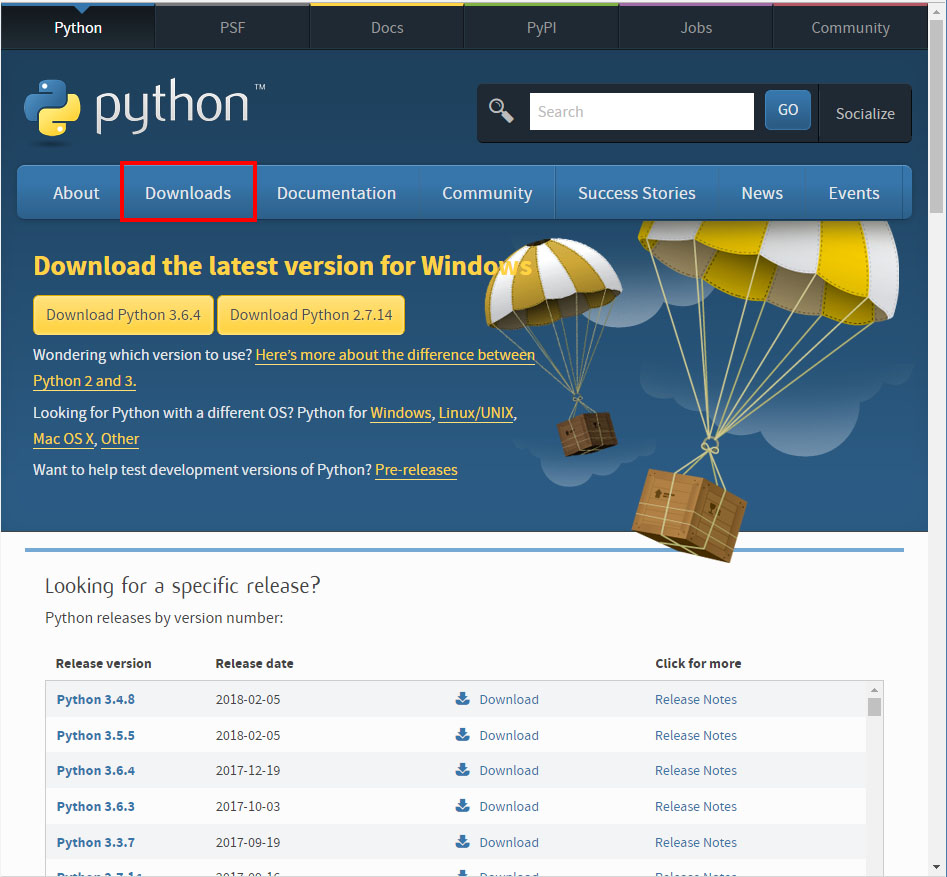

상단에 다운로드 버튼 클릭!

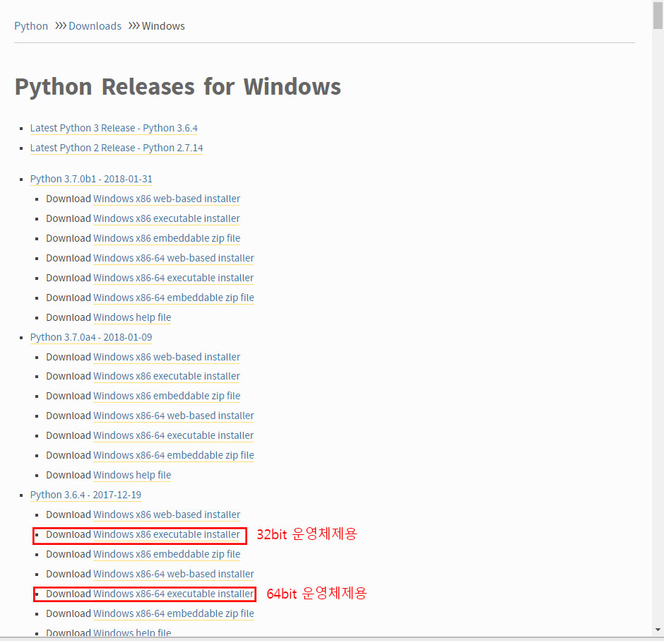

다운로드 버튼을 클릭하면 위와 같이 무수한 버전들이 있습니다. 파이썬은 아직도 발전을 지속하고 있는 언어인지라 계속해서 새로운 버전들이 나오고 있는 상황입니다. 가장 최신버전이 3.7.0 버전이지만, 현재 가장 안정화된 버전이라고 칭해지는 3.6.4버전으로 다운로드 해줍니다. 3.6.4 버전이나 3.7.0 버전이나 같은 python 3버전이기 때문에 기능상의 차이를 전혀 걱정하 마시고 3.6.4 ㄱ ㄱ ㄱ

#### 설치시작!

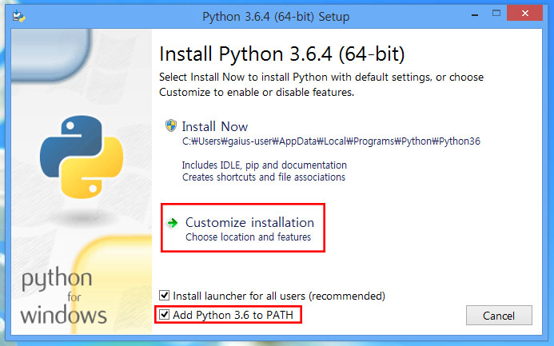 

다운로드 받은 파일을 실행하면 위와 같은 화면이 나옵니다. 여기서 중요한 것은 `Add Python 3.6 to PATH` 부분을 선택해주셔야 합니다. 나중에 pycharm 설치시 경로를 따로 수정해주어야 하기 때문에, 해당 경로를 미리미리 세팅하기 위한 옵션이라 생각하시고 진행하시면 되겠습니다.

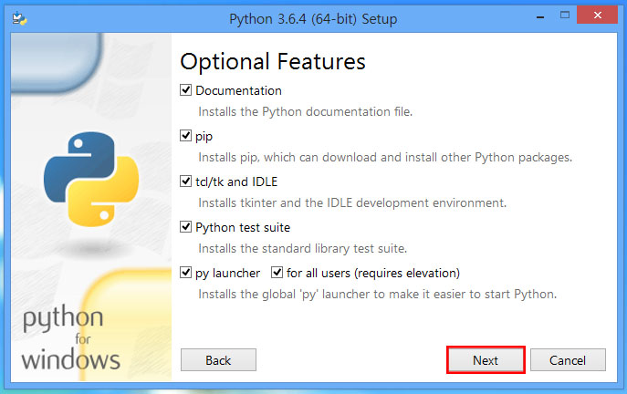

다음화면에서는 위와같이 모드 체크체크 하시고 Next!

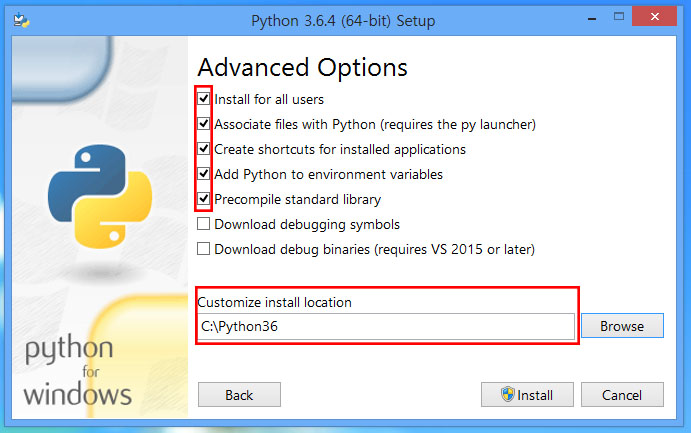

다음화면에서는 위의 5가지 항목을 모두 체크해주시고, `Customize install location` 항목에 위와 같은 경로를 입력합니다. 이는 윈도우가 설치된 C: 드라이브 최 상단에 Python36이라는 폴더를 만들고, python 실행파일들을 모조리 그 안으로 넣겠다는 뜻입니다. 나중에 파이썬이 설치가 된 이후에, 파이썬을 실행할 인터프리터가 저 경로에 들어가니, 이 경로는 기억해두시는 것도 아주아주 좋습니다. (그러나 설치만 잘 되면 굳이 기억하지 않으셔도 우리의 파이참께서 친히 해당 경로를 찾아주시니 너무 걱정하지 않으셔도 됩니다.)

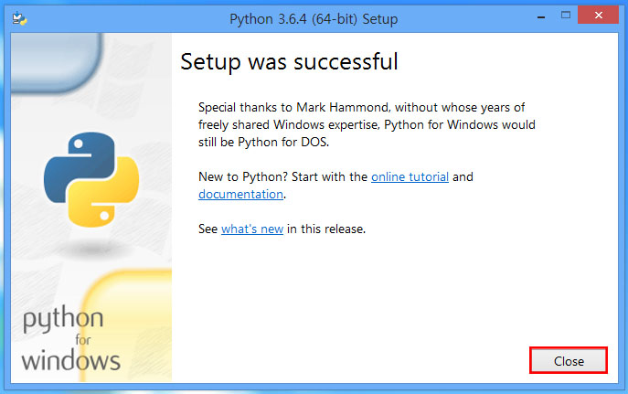

파이썬 설치가 완료되었습니다!

해당 경로에 제대로 설치가 되었는지 확인해볼까요?

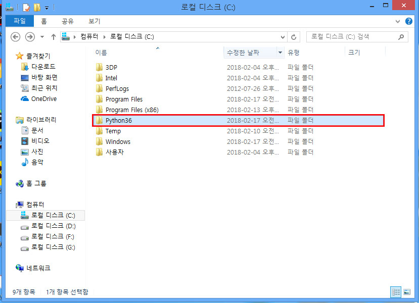

넵 아주 좋습니다. 

## pycharm 설치

##### pycharm(파이참)? IDE?

 파이참은 jetbrains사에서 판매하는 IDE 프로그램입니다. <a href='https://ko.wikipedia.org/wiki/%ED%86%B5%ED%95%A9_%EA%B0%9C%EB%B0%9C_%ED%99%98%EA%B2%BD'>IDE(Integrated Development Environment)</a> 프로그램을 쉽게 이야기하면 프로그램을 만드는 여러 과정들을 한 곳에서 모두 할 수 있도록 모아놓은 툴이라 할 수 있습니다. 사실 위와같이 파이썬을 설치하고 나면 .py라는 확장자를 가진 파일들을 실행하는 것엔 아무 무리가 없습니다. 단순하게, 메모장에다가 파이썬 코드를 적어놓고 커멘드 라인에다가 `python 파일명.py` 라고 명령하면 해당 파이썬 코드가 실행되죠.

 하지만 프로그램의 복잡도가 올라갈 수록 위와 같은 코딩 방법은 여러가지 한계를 가지게 되는데, 이러한 한계들을 넘어서서 편리하게 코딩할 수 있도록 도와주는 툴이 바로 IDE입니다. 파이참은 수많은 IDE 프로그램들 중의 하나인 것이지요. pycharm을 활용하면 다음과 같은 이점을 얻을 수 있습니다.

	1. 코드의 오타를 매우 쉽게 찾아준다.(빨간 밑줄, 노랑 밑줄, 초록 밑줄, indentation 등등)
	2. 코드의 실행과 작성을 한 화면에서 동시에 진행 할 수 있다.
	3. 코드가 실행되는 과정을 하나하나 볼 수 있다.
	4. 디버깅이 용이하다. 등등

이 외에도 무수한 장점들이 있어서 최근에는 IDE를 많이 사용하는 추세입니다.

#### pycharm 다운로드!

pycharm 홈페이지의 다운로드 페이지(https://www.jetbrains.com/pycharm/download/)를 접속합니다.

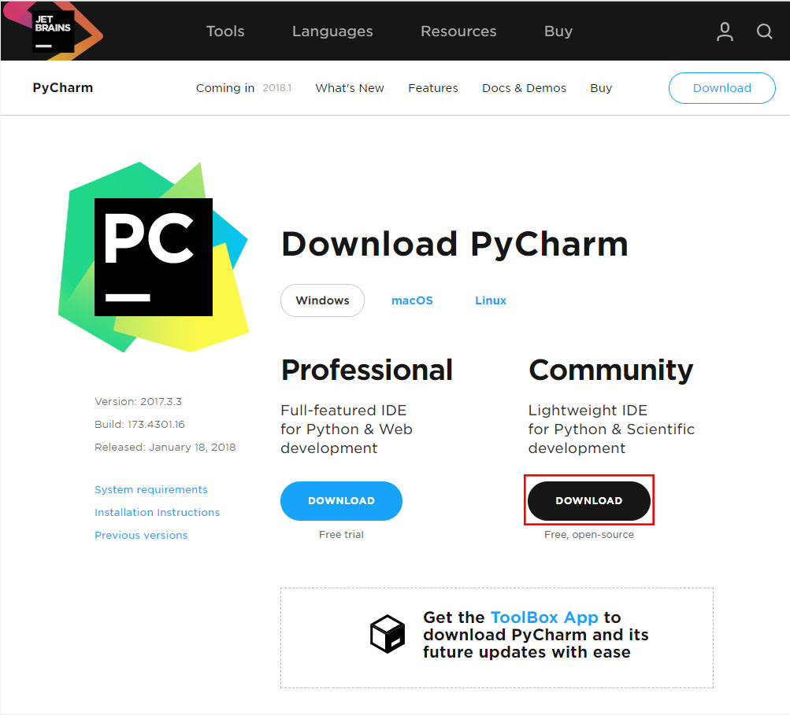

위 화면에서 해당하는 window OS를 선택하고, Community 버전을 선택합니다.

pycharm은 현재 몇가지 버전이 있고, 풀버전은 Professional 버전이나 이게 유료입니다. 하지만 누구나 사용할 수 있는 Community 버전은 무료인데도 풀버전의 대부분의 기능들을 지원하기 때문에, Community 버전으로도 코딩하는데 별 무리가 없습니다. 이제 막 파이썬에 입문하시는 분들은 일단 Community 버전으로 pycharm에 익숙해지신 이후에 유료버전으로 갈아타는 것을 추천드립니다!

(참고로 학생이신 분들은 무료로 Professional 버전을 사용할 수 있도록 JetBrains사에서 배려하고 있습니다!)

#### pycharm 설치!

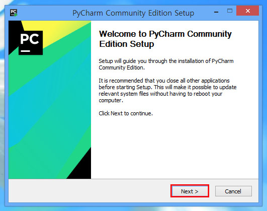

파이참 설치파일 실행하면 위와 같이 반갑다고 합니다. 가볍게 Next 눌러줍니다.

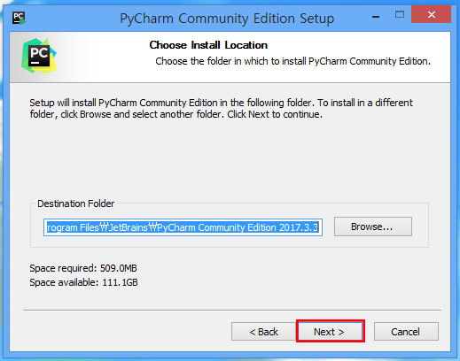

파이참을 설치할 경로를 지정하는 화면인데, 이것도 기본적으로 지정해주는 경로를 사용하도록 합시다. Next!!

설치된 윈도우 운영체제 환경에 따라 선택하신 후 Next 버튼! (32비트 운영체제이신 분들은 32비트 선택하시면 되겠습니다.)

별 의미 없습니다. -> Next!!

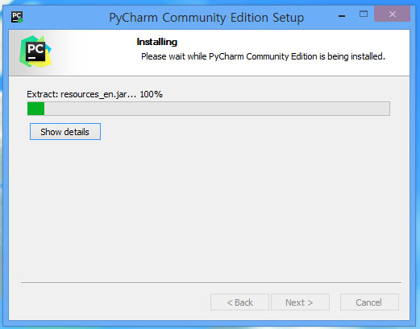

설치가 진행중 입니다~~~~

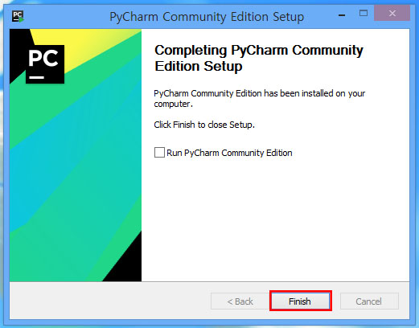

가볍게 pycharm 설치를 완료하였습니다!

#### pycharm 실행!

이제 설치된 pycharm을 실행해 보도록 하겠습니다. 

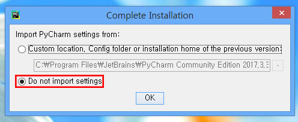

아마 pycharm을 처음으로 실행하면 위와같은 화면이 나오는데요. pycharm의 settings파일을 가지고 있다면 첫번째 버튼을 눌러서 pycharm settings를 한큐에 끝낼 수 있겠지만, 우리는 완전 처음하는 것이므로 그런 설정파일이 있을리 만무합니다. 미련없이 `Do not import settings` 선택하고 OK 누르시면 되겠습니다.

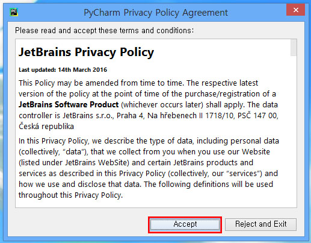

일단 공짜니까 동의해줍니다.

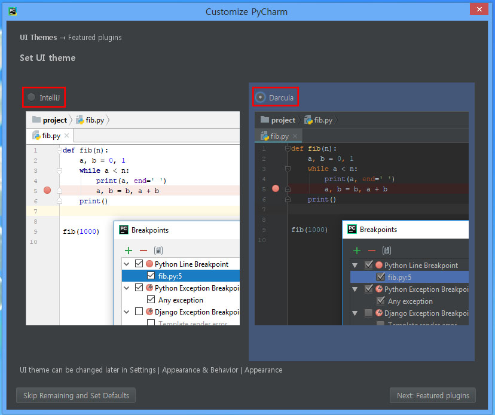

파이참의 스타일을 지정해주는 설정입니다. 큰 의미는 없고, 너는 하얀 화면이 좋니? 아님 까무잡잡한 화면이 좋니? 이런 의미입니다. 본인 기호의 맞게 선택해 줍니다. (저는 까무잡잡이 좋습니다.)

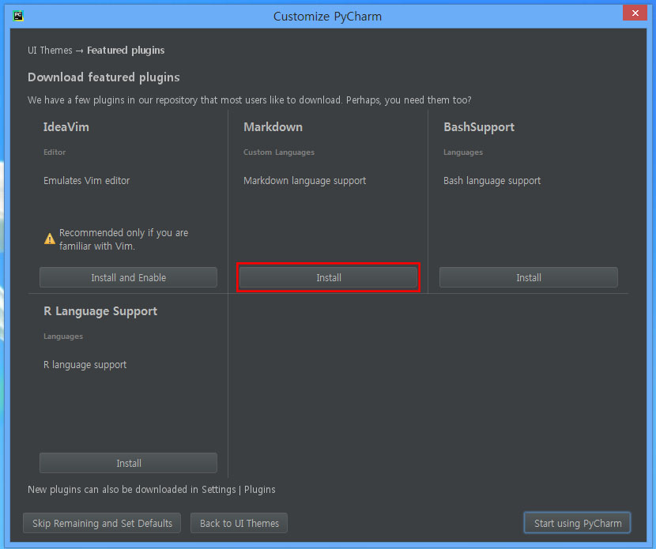

다음 화면으로 넘어가면 기본적인 플러그인을 설치할 수 있도록 하는 부분이 나옵니다. 이 부분은 그냥 지나쳐도 되나, 마크다운은 많이 쓰기 때문에 하나 설치해주고 다음으로 가는 것을 추천합니다. 하지만 위 플러그인은 나중에 설정화면에서 언제든지 설치했다가 지웠다가 할 수 있는 부분이기 때문에 크게 신경쓰지 않으셔도 되겠습니다.

#### Project 시작!

위의 설정을 마무리하면 파이참이 실행되고 Project를 생성할 수 있습니다.

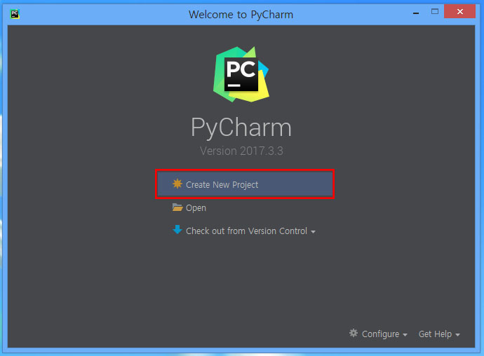

`Create New Project` 클릭!

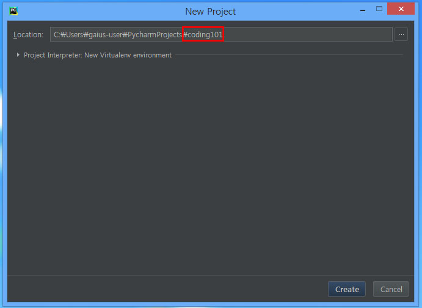

프로젝트 폴더명을 지정해 줍니다. 프로젝트 이름이 곧 프로젝트 폴더명이 될 것이기때문에 영문과 숫자 혹은 only 영문 형식으로 지어주시면 되겠습니다.(한글.. 가능하나 매우매우 추천하지 않습니다.)

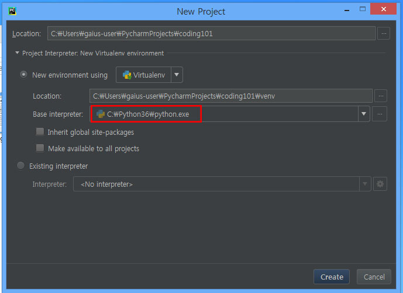

이 부분이 **아주아주 중요한 부분**입니다. 바로 <u>앞서 설치한 파이썬과 이번에 설치한 파이참을 서로 연결</u>시켜주는 부분인데요. 위와 같이 앞서 설치한 파이썬 경로가 정확하게 나온다면 파이썬 설치도 제대로 된 것이고, 파이썬과 파이참이 순조롭게 연결이 된 것입니다. 아마 본 과정을 정확하게 따르셨다면 파이참이 알아서 파이썬의 경로를 인식했을 겁니다.

만약 아래와 같이

Interpreter field is empty라는 에러메세지가 떳따면, 1)파이썬을 설치하신 후 파이참을 다시 실행하시거나, 2)python.exe 파일이 있는 경로를 따로 지정해주시면 되겠습니다. 우리의 경우에는 C:\Python36\python36 이겠죠!

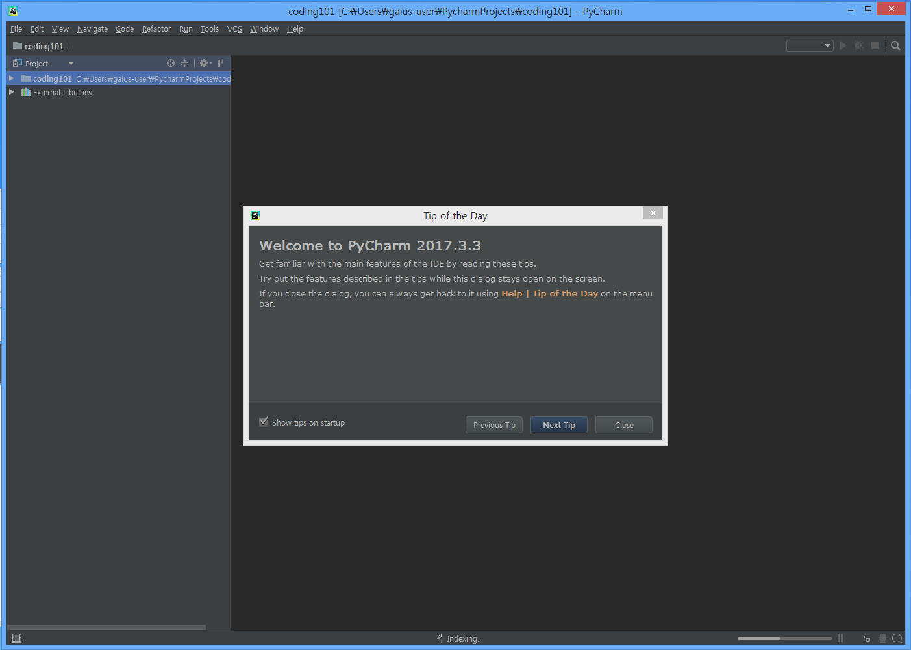

파이참 프로젝트 화면으로 멋지게 진입한 화면입니다! 오자마자 파이참 사용에 대한 Tip이 나오는데요. 이게 매일마다 바뀌니 초보분들은 Tip을 하나씩 보면서 파이참의 숨은 기능들을 익히는 것도 나쁘지 않을 겁니다.

#### pycharm terminal 사용법

파이썬 프로젝트 내에서 터미널을 사용하는 방법이 있습니다. 굳이 cmd.exe를 윈도우+R 키 눌러가면서 따로 사용하실 필요 없습니다. 

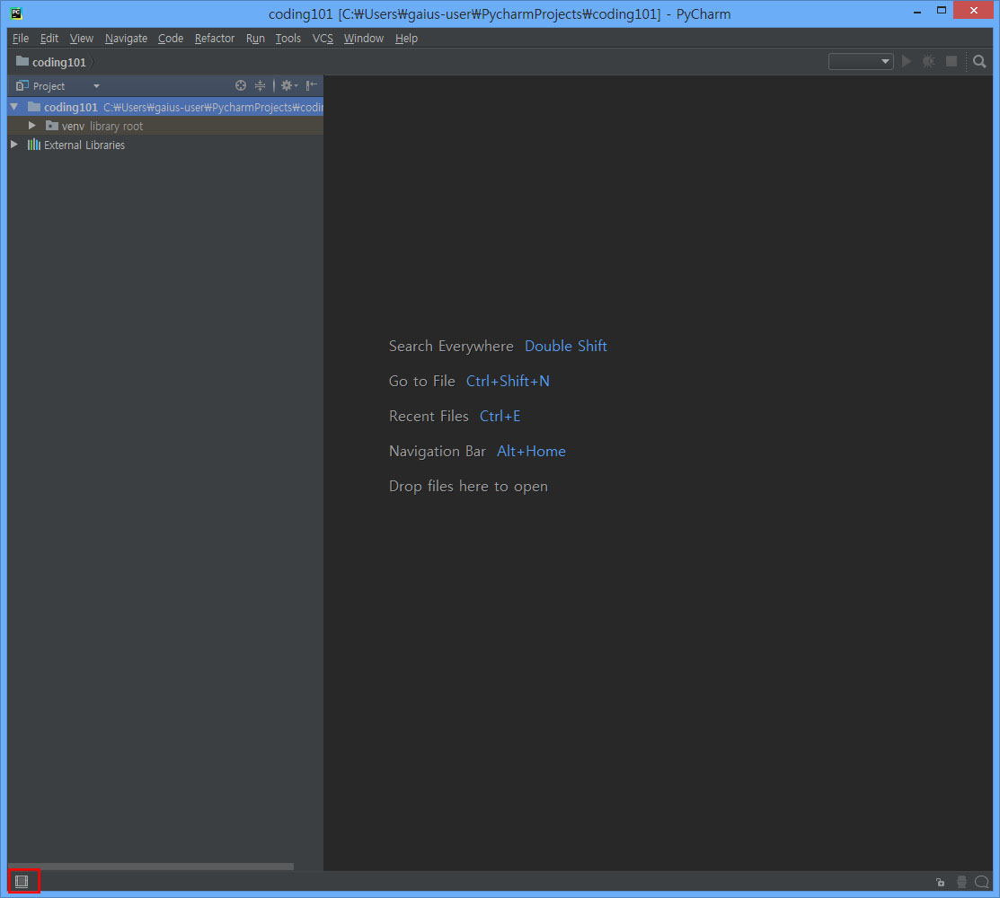

파이참 좌측 맨 하단에 네모 버튼을 눌러보시면 하단 창 화면을 무엇으로 할지 선택하는 드롭업? 버튼이 나오는데요. 거기서 terminal을 눌러줍니다.

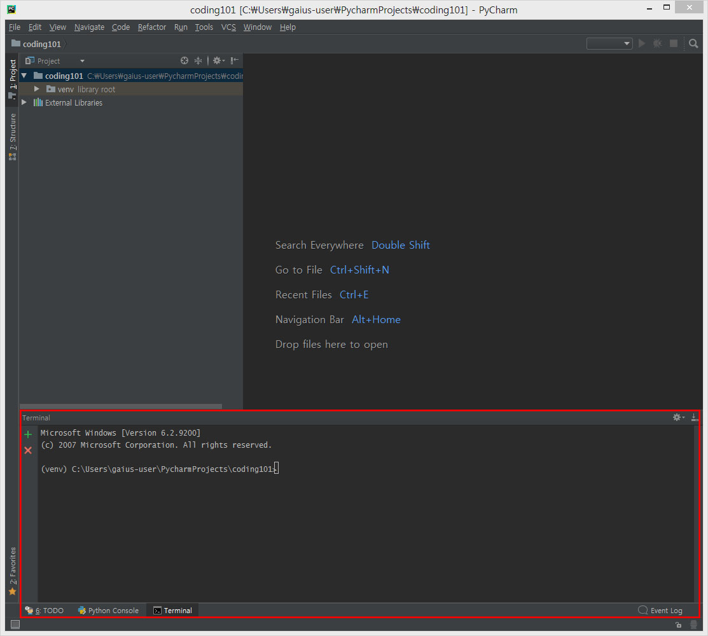

그러면 이렇게 화면 하단이 terminal로 바뀌게 되고, 심지어는 실행경로가 딱 우리가 지정했던 프로젝트 경로와도 일치시켜 줍니다. 파이참을 사용하신다면 앞으로는 따로 터미널창을 키지말고 파이참 내에서 사용하는 것이 더 편리하겠지요!

## 코드를 쳐보고, 실행을 해보자

여기까지 오시느라 수고 많으셨습니다. 이제 본격적으로 코딩할 준비가 끝났습니다. 그럼 이 기세를 몰아 실제로 코드를 쳐보고 실행까지 후딱 해치워보도록 하겠습니다.

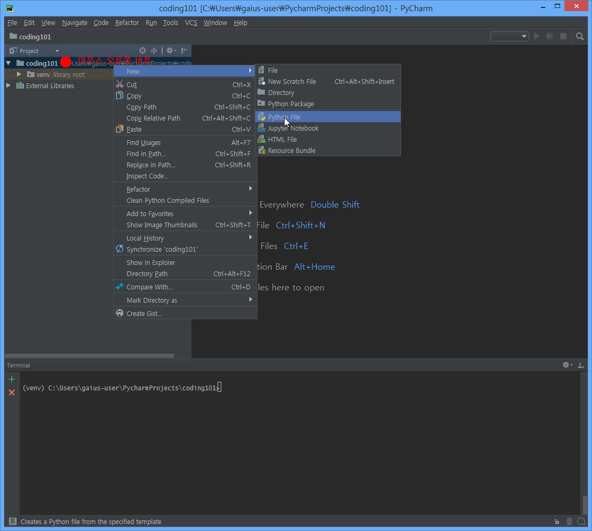

프로젝트 폴더에서 마우스 오른쪽버튼을 누르고 파이썬 파일 하나를 생성해 줍니다.

파이썬 파일명을 지정해주시고, 마지막은 항상 .py 확장자명을 가지도록 해줍니다.

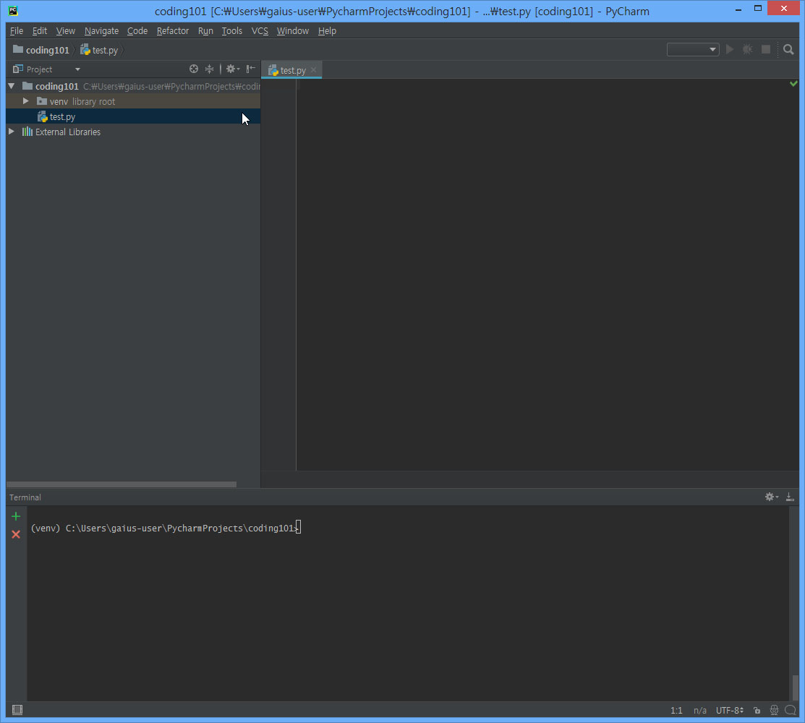

그럼 위와 같이 파이썬 파일이 하나 만들어진 모습을 볼 수 있습니다.

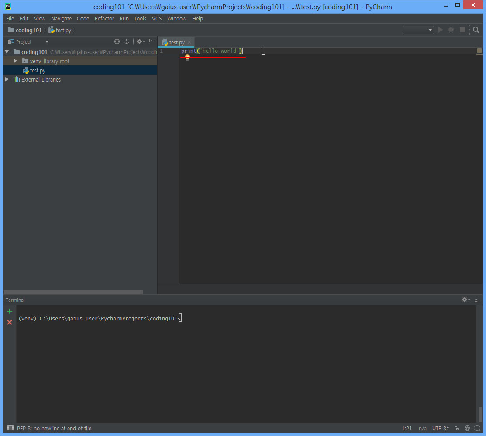

여기에 파이썬 코드를 넣으시고(참고로 위의 `print('Hello world')`라는 문법은 단순히 Hello world를 출력하라는 문법입니다.)

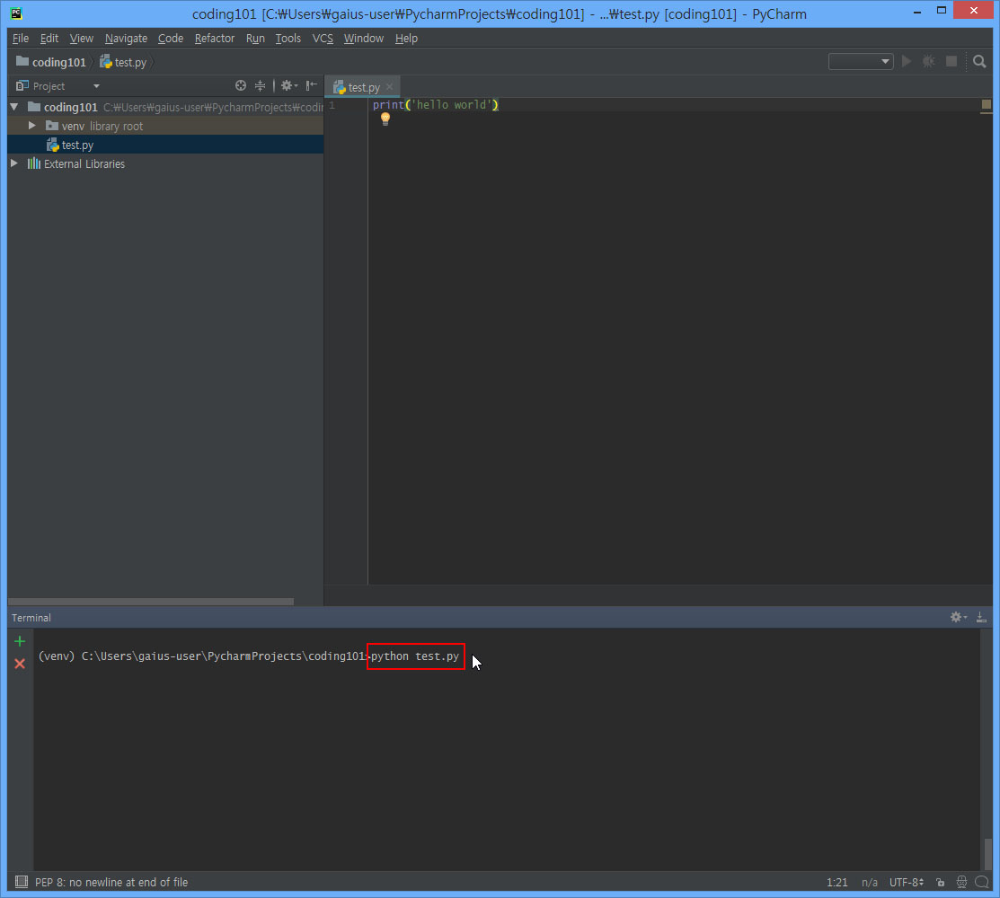

하단의 터미널 창에서 파이썬 파일을 위와 같이 실행하시면!

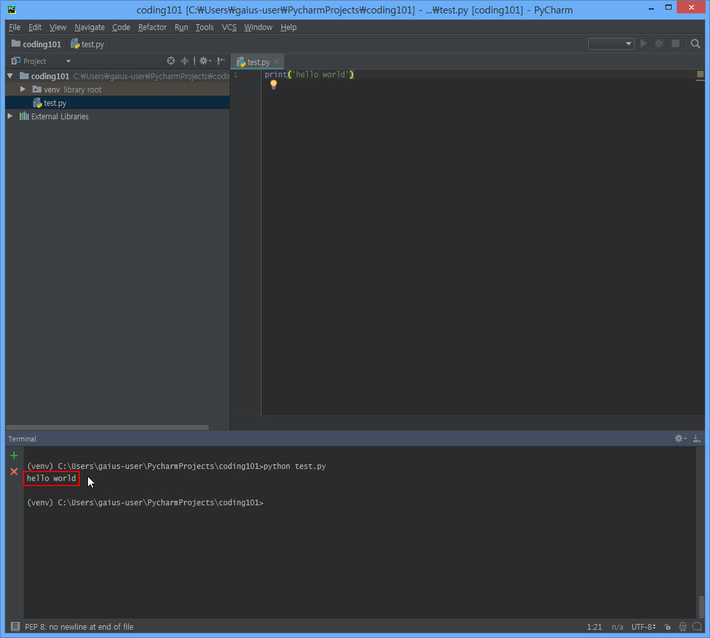

위와같이 입력했던 코드가 실행된 모습을 보실 수 있습니다!

여기까지 우리는 윈도우 환경에서 파이썬을 설치하고, 파이참을 설치하고, 파이썬 파일을 실행까지 해보았습니다. 이정도면 파이썬을 제대로 해보기 위한 준비가 마쳐졌다고 할 수 있겠습니다. 이후부터는 파이썬 문법과 프로그래밍에 집중할 수 있을 것 같군요!

안되는 부분이나, 궁금하신 사항이 있으시다면 gaius827@gmail.com으로 문의주시면 시간날때마다 답변드리겠습니다! 감사합니다.