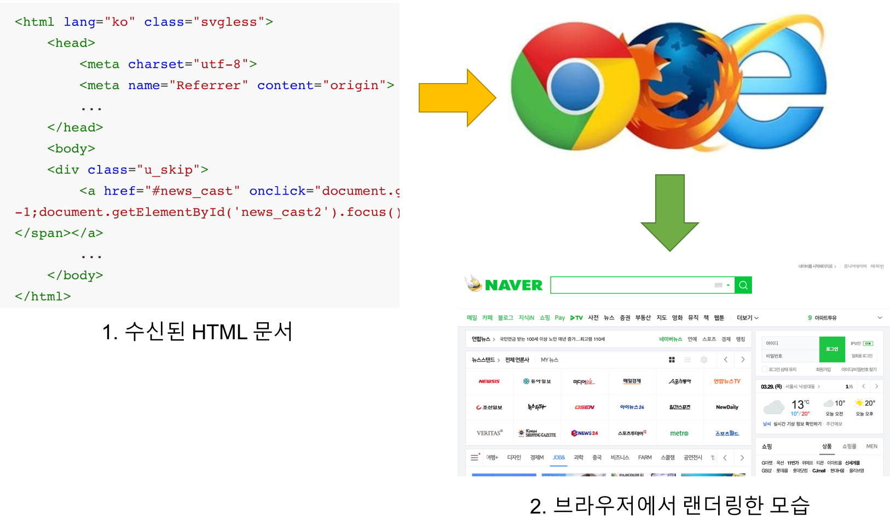
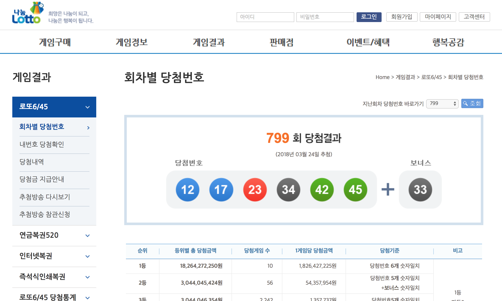
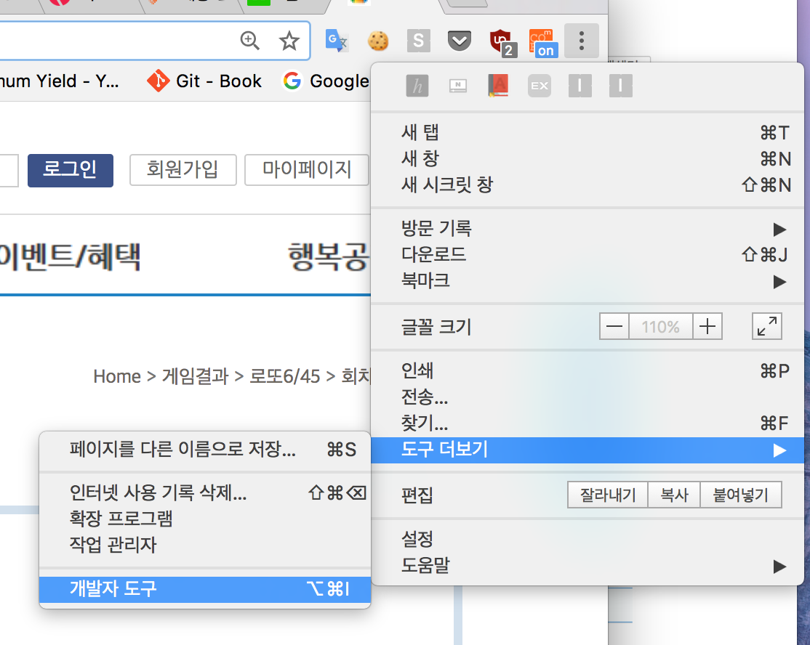
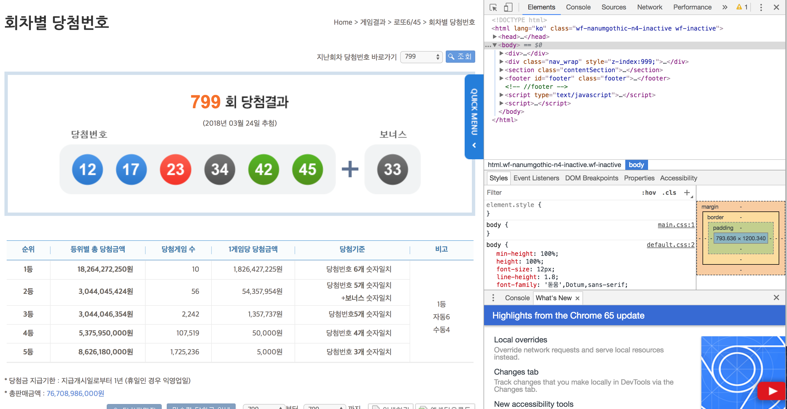
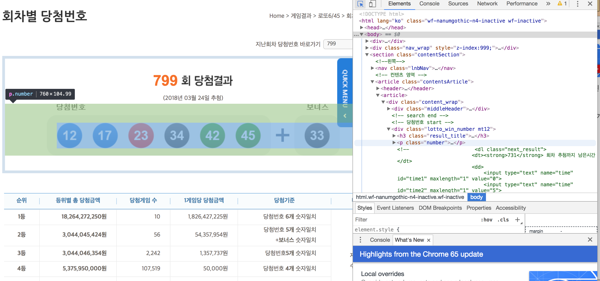

## Web Crawling Basic

웹크롤링은 무엇이고 어떻게 가능한 것인지 간략하게 살펴보겠습니다. 크롤링의 <a href="https://namu.wiki/w/%ED%81%AC%EB%A1%A4%EB%A7%81">간략한 설명 (나무위키)</a>을 보시면 아시겠지만, 웹페이지 상에 있는 데이터를 추출해내는 행위입니다. 웹 상의 데이터를 주기적으로 수집하거나 해당 데이터를 반복적으로 살펴봐야하는 경우에 매우 유용하고, 최근에는 통계를 낸다거나 데이터 기반 서비스를 만들때도 많이 사용하는 기법입니다.


### crawling의 원리

크롤링이 어떻게 가능한지 살펴보려면 아래의 필수적인 개념들을 익히실 필요가 있습니다.


#### Client, Server, HTML 개념

웹이 동작하는 방식을 이해하실 필요가 있겠습니다. 웹페이지를 사용함에 있어서 가장 기본적인 주체가 두 곳이 있습니다. 한 쪽은 **요청을 보내는 쪽**이고 다른 한 쪽은 **그 요청에 대한 답장을 보내는 쪽**입니다.

흔히 요청을 보내는 쪽을 **Client**라고 합니다. 우리가 흔히 사용하는 웹브라우저(인터넷익스플로러, 크롬, 사파리, 파이어폭스 등)가 대표적인 Client의 예입니다. PC든 Mobile이든 웹브라우저는 가장 기본적인 어플리케이션 중 하나이죠!

반대로 요청을 받고 그걸 처리해서 다시 응답(response)를 보내는 쪽이 **Server**가 되겠습니다.

그렇다면 Client와 Server는 무엇을 주고 받을까요? 

Client는 http://www.naver.com 과 같은 http 요청을 보내면

Server는 그 요청에 해당하는 답변으로 다음과 같은 문서를 내려줍니다.

```html
<html lang="ko" class="svgless">
	<head>
		<meta charset="utf-8">
		<meta name="Referrer" content="origin">
		...
	</head>
	<body>
	<div class="u_skip">
		<a href="#news_cast" onclick="document.getElementById('news_cast2').tabIndex = -1;document.getElementById('news_cast2').focus();return false;"><span>뉴스스탠드 바로가기</span></a>
		...
	</body>
</html>
```

하지만 우리가 보는 화면은 저런 코드덩어리가 아니죠? 그 이유는 우리가 사용하는 웹브라우저가 저 코드덩어리를 직접 해석해서 우리가 흔히 보는 웹페이지의 형태로 다시 만들어주기 때문입니다.




우리가 흔히 쓰는 인터넷 웹브라우저의 역할이 이제 명확해졌죠. 서버에 html문서를 달라고 요청을 보내고, 받은 html문서를 사람이 볼 수 있는(?) 형태로 변환시켜줍니다.

크롤링은 이와 같이 웹브라우저의 동작 원리를 응용한 기법입니다. 우리가 위의 동작방식에서 얻을 점은 다음과 같습니다.


1. 웹에서 보여지는 내용은 html문서로 이루어져 있다.(웹에서 가져오고 싶은 데이터는 해당 html 문서 어딘가에 있다.)
2. 서버에 url 요청을 보내면 html 문서가 내려온다.


위 두가지 사항과 더불어서 파이썬의 두가지 사실만 덧붙이면 python 크롤링의 기능을 완성할 수 있는 겁니다.

3. 파이썬으로 마치 브라우저에서 요청을 보내듯이 보낼 수 있는 라이브러리가 있다. (requests)
4. 파이썬은 html 내용을 쉽게 파싱할 수 있는(쪼갤 수 있는) 라이브러리가 있다. (BeautifulSoup4)


#### 로또번호 크롤링하기

실습은 파이썬3 기준으로 진행합니다. 파이썬3가 설치되어 있다고 가정하고 시작하겠습니다. 사용하는 브라우저는 크롬이고, 크롬의 개발자도구를 사용하였습니다.


##### 필요한 라이브러리 설치

우선 크롤링 코드를 짜기 전에 사용할 라이브러리부터 설치하도록 하겠습니다. 터미널에서 다음의 명령어를 입력해서 필요한 3가지 라이브러리를 설치합니다.

[requests 라이브러리 설치] - 브라우저가 서버에게 요청을 보내듯이, 파이썬이 서버에 직접 요청을 보내도록 도와주는 기능

```bash
pip install requests
```

http://docs.python-requests.org/en/master/


[beautifulsoup 라이브러리 설치] - 받은 html 문서를 파싱하는 기능

```bash
pip install beautifulsoup4
```

https://www.crummy.com/software/BeautifulSoup/bs4/doc/


[lxml 설치] - beautifulsoup lxml 모드 사용시 필요

```bash
pip install lxml
```


위 세가지 기능을 다 설치하고 난 후 ```pip list``` 명령어를 통해서 정상적으로 설치되어 있는지 확인합니다.


##### HTML 구조 분석하기

크롤링을 하려면 먼저 내가 찾고자 하는 데이터가 어디에 있는지, 어떤 구조로 되어 있는지 확인해야 합니다. 이번 예제에서는 로또 사이트에서 당첨번호를 크롤링해보겠습니다.

사이트 URL: http://nlotto.co.kr/gameResult.do?method=byWin




우리는 여기서 회차와 당첨번호 6개, 보너스번호 1개를 가져올 예정입니다.

1단계로 크룸의 고유 기능인 개발자도구를 통해서 HTML 구조를 한번 파악해보도록 하겠습니다.



크롬 오른쪽 상단에 보시면, 위와 같은 메뉴가 있는데요. 거시서 '도구 더보기' > '개발자 도구'를 클릭하시면



이렇게 HTML code 가 나옵니다. 이 개발자 도구를 잘 활용하면 현재 우리가 보고 있는 웹페이지가 어떤 html 코드로서 표현된 것인지 한눈에 확인 할 수 있습니다.

상단에 보면 다음과 같은 아이콘이 있는데요. 이 아이콘을 클릭하여 활성화 시킨후 웹페이지 상에 마우스를 올리면 그 마우스가 가리키고 있는지점의 html 코드를 보여줍니다.


저는 로또 번호를 표현한 곳이 궁금하기 때문에, 로또 번호가 있는 곳으로 마우스를 클릭해보겠습니다.




이렇게 보니 로또 번호는 전체 html 중에 다음코드 안에 있는 것을 확인 할 수 있습니다.

```	html
......
<div class="lotto_win_number mt12">
	<h3 class="result_title"><strong>799</strong> 
    
    <span>(2018년 03월 24일 추첨)</span></h3>
    <p class="number">
    	
    	
    	
    	
    	
   		
        <span class="plus">+</span>
        <span class="number_bonus"></span>
                     </p>
                      
<!--                      <dl class="next_result">
                         <dt><strong>731</strong> 회차 추첨까지 남은시간</dt>
                         <dd>
                             <input type="text" name="time" id="time1" maxlength="1" value="0">
                             <input type="text" name="time" id="time2" maxlength="1" value="5">
                             
                             <input type="text" name="time" id="time3" maxlength="1" value="1">
                             <input type="text" name="time" id="time4" maxlength="1" value="2">
                             
                             <input type="text" name="time" id="time5" maxlength="1" value="0">
                             <input type="text" name="time" id="time6" maxlength="1" value="8">
                         </dd>
                     </dl>  -->
                 </div>
......
```

 위 화면에서 12, 17, 23, 34, 42, 45, 33 의 정보가 **<u>1)lotto_win_number라는 class를 가진 div 테그 안에</u>**,  **<u>2) number라는 class를 가진 p 테그 안에</u>**, **<u>3) img 테그 안에 alt라는 변수 값</u>**에 들어 있는 것이보이시나요? 우리가 찾고자 하는 정보가 alt안에 있다는 힌트를 얻었다면 본격적인 크롤링 작업의 준비가 된 것입니다. 


##### Python 크롤링 코드 작성

1단계에서는 우리가 찾고자 하는 데이터가 html 상 어디에 위치해 있는지 파악했습니다. 이제 본격적으로 파이썬을 통해서 해당 데이터를 정제하는 작업을 진행하겠습니다.

```python
# -*- coding: utf-8 -*-
import requests
from bs4 import BeautifulSoup
```

먼저 최상단에 우리가 앞서 설치한 라이브러리를 불러와 줍니다.


###### requests 라이브러리

```python
site = 'http://nlotto.co.kr/gameResult.do?method=byWin'
response = requests.get(site)
print(response.text)
```

requests 라이브러리 사용법입니다. requests 라이브러리는 http의 대부분의 요청기능을 사용할 수 있는데요. 우리는 일반적인 사이트 url 요청인 get을 사용합니다.(<a href='https://ko.wikipedia.org/wiki/HTTP'>http</a>에 대해서 따로 공부해보시는 것도 매우 좋습니다.)

여기까지 작성하고 한번 실행을 해보면

```html
<html lang="ko" class="wf-nanumgothic-n4-inactive wf-inactive"><head>
    <!-- common js, css include -->
    <meta http-equiv="X-UA-Compatible" content="IE=edge,chrome=1">
......
......
    		return false;
		}
	});
	
});
</script>

</body></html>
```

아마 엄청나게 긴 html 문서형태가 출력되는 것을 보실 수있습니다. 바로 requests 라이브러리는 앞서 설명한 브러우저와 같이 서버에 요청을 보내주는 기능을 하는 것입니다. 일반적인 사용자가 보는형태로 랜더링은 안하지만 우리가 필요한 html 문서를 요청해서 받아오는 것까지는 아주 충실히 수행해줍니다.

위 코드에서 ```responses.text``` 가 바로 우리가 받고자 하는 html source라는 것을 기억하고 이제 이 html source를 beautifulsoup 라이브러리로 넘겨야 합니다.


```python
soup = BeautifulSoup(response.text, 'lxml')
```

이렇게 하면 BeautifulSoup(대소문자 주의) 라이브러리를 사용해서 ```soup```이라는 객체를 하나 만들게 됩니다. 그럼 이제 beautifulsoup의 고유 기능을 사용할 수 있는 html이 되는 것입니다. 

**1)lotto_win_number라는 class를 가진 div 테그**의 내용만 짤라온 후 그 결과를 number_part라는 변수에 저장하겠습니다.

```python
number_part = soup.find('div', {'class': 'lotto_win_number'})
```


그러면 number_part에는 다음과 같은 내용이 저장됩니다. (코드 마지막에 ```print(number_part)```를 추가하면 확인 가능)

```python
<div class="lotto_win_number mt12">
<h3 class="result_title"><strong>799</strong>

<span>(2018년 03월 24일 추첨)</span></h3>
<p class="number">


<span class="plus">+</span>
<span class="number_bonus"></span>
</p>
<!--                      <dl class="next_result">
                         <dt><strong>731</strong> 회차 추첨까지 남은시간</dt>
                         <dd>
                             <input type="text" name="time" id="time1" maxlength="1" value="0">
                             <input type="text" name="time" id="time2" maxlength="1" value="5">
                             
                             <input type="text" name="time" id="time3" maxlength="1" value="1">
                             <input type="text" name="time" id="time4" maxlength="1" value="2">
                             
                             <input type="text" name="time" id="time5" maxlength="1" value="0">
                             <input type="text" name="time" id="time6" maxlength="1" value="8">
                         </dd>
                     </dl>  -->
</div>

```


이중에서 우리가 필요한 부분은 **<u>2) number라는 class를 가진 p 테그</u>** 안의 정보이기 때문에 해당 범위로 다시한번 한정지어 보겠습니다.

```python
win_numbers_p = number_part.find('p', {'class': 'number'})
```

number_part 안에서 다시 class가 number인 p 테그만 찾아서 추려서 win_numbers_p 변수에 저장해라 라는 코드 입니다.


이렇게 하면 win_numbers_p 라는 변수에는 다음과 같은 내용이 담깁니다.

```python
<p class="number">


<span class="plus">+</span>
<span class="number_bonus"></span>
</p>
```

범위가 확 줄어들었죠?

또 여기서 우리가 필요한 것은 img테그로 구성되어 있는 로또 번호이기 때문에 다시 img만 쭉 가지고 올 것입니다. 하지만 이번엔 find 말고 find_all이라는 기능을 써서 가져올 것입니다. find는 beautifulsoup tag 한 객체(덩어리)를 가지고 오지만 find_all은 조건에 해당하는 모든 tag를 list형태로 반환한다는 점에서 매우 다르게 동작합니다.

한번 사용해볼까요?

```python
win_numbers = win_numbers_p.find_all('img')
```

앞서 구한 win_numbers_p 에서 모든 img 테그를 찾아서, 각 이미지 테그를 리스트로 반환한 후, win_numbers라는 변수에 저장하는 구문입니다.

이렇게 하면 win_numbers는 

```python
[
    , 
    , 
    , 
    , 
    , 
    , 
    
]

```

이런식으로 list의 형태를 가지게 됩니다. 하지만 리스트 안의 각 개별 내용들은 종전에 사용한대로 beautifulsoup 테그의 형태이기 때문에 우리는 for in 문을 활용해서 우리가 원하는 당첨번호를 추려낼 것입니다.

마침 img 테그 안의 alt라는 값에 우리가 찾는 로또 당첨번호가 들어있습니다. 각 테그안에 들어있는 값을 조회할 때는 dictionary의 값을 조회하듯이 하면 되겠습니다.

```Python
for tag in win_numbers:
    print(tag['alt'])
```


result

```python
12
17
23
34
42
45
33
```


최종 결과물

```python
import requests
from bs4 import BeautifulSoup

site = "http://nlotto.co.kr/gameResult.do?method=byWin"
response = requests.get(site)

soup = BeautifulSoup(response.text, 'lxml')
number_part = soup.find('div', {'class': 'lotto_win_number'})
win_numbers_p = number_part.find('p', {'class': 'number'})
win_numbers = win_numbers_p.find_all('img')

for tag in win_numbers:
    print(tag['alt'])
```

이제 이 코드만 있으면 가장 최신화된 로또번호 리스트를 보너스번호까지 매번 가져올 수 있겠죠?


